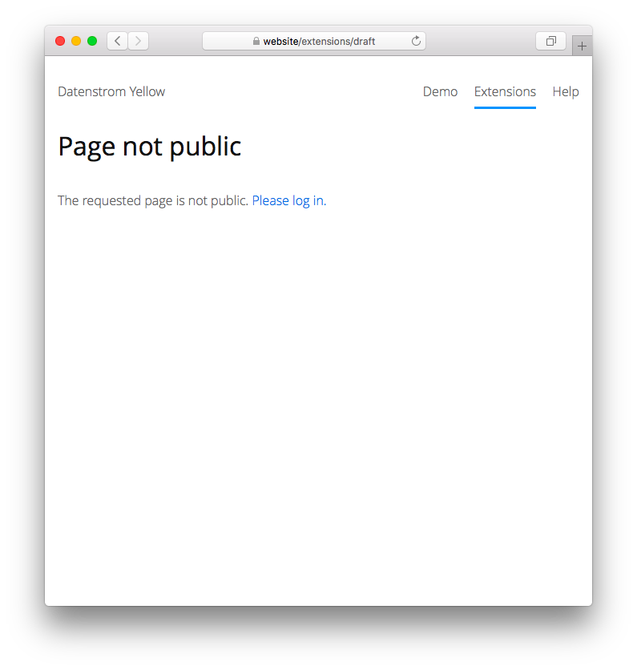

# Autopublish 0.8.20

Schedule automatic publishing of pages.

## How to install an extension

[Download ZIP file](https://github.com/GiovanniSalmeri/yellow-autopublish/archive/refs/heads/main.zip) and copy it into your `system/extensions` folder. [Learn more about extensions](https://github.com/annaesvensson/yellow-update).

## How to schedule a page

Set a future `Published` date in the [page settings](https://github.com/annaesvensson/yellow-core#settings-page) at the top of the page. Only once the date has been reached will the page become visible. You can continue to edit the page in a [web browser](https://github.com/annaesvensson/yellow-edit) and on your [computer](https://github.com/annaesvensson/yellow-core). For further details see the [draft extension](https://github.com/annaesvensson/yellow-draft).

## Examples

Content file with a new year's message for the blog:

    ---
    Title: Happy New Year
    Published: 2030-01-01
    Author: Datenstrom
    Layout: blog
    Tag: Example
    ---
    We wish you all a happy new year!

Content file with future publication date for the blog:

    ---
    Title: Favourite moments of the year
    Published: 2030-12-01
    Author: Datenstrom
    Layout: blog
    Tag: Example
    ---
    This page will become visible in December.

Content file with future publication date and time for the blog:

    ---
    Title: Favourite moments of the year
    Published: 2030-12-01 08:00:00
    Author: Datenstrom
    Layout: blog
    Tag: Example
    ---
    This page will become visible in December.

## Settings

The following setting can be configured in file `system/extensions/yellow-system.ini`:

`CoreTimezone` = timezone of the website, [supported timezones](https://www.php.net/manual/en/timezones.php)  

## Developer

Giovanni Salmeri. [Get help](https://datenstrom.se/yellow/help/).
